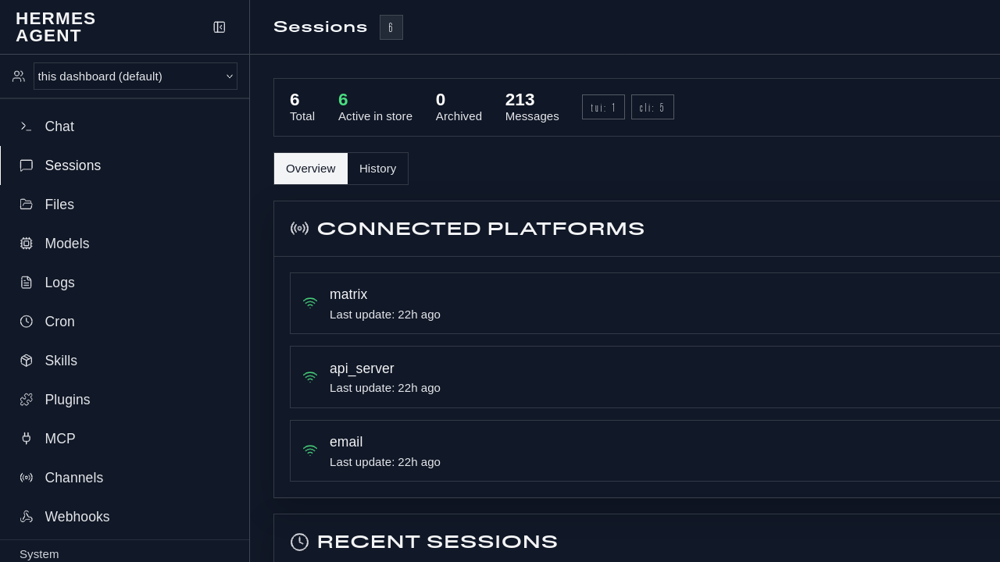

# Hermes Dashboard Readable Dark Theme

A reusable, readability-first dark theme for the Hermes Agent dashboard.

It replaces the default novelty-heavy dashboard look with a neutral slate/blue dark palette, high-contrast text, larger system fonts, visible borders, no grain/noise overlay, and no decorative display fonts.

## Screenshot



## What it changes

- Neutral dark slate surfaces with subtle blue/gray gradients
- 25% larger base font size (`20px`) and comfortable line height
- System UI fonts for normal and display text
- High-contrast semantic text tokens
- Visible card/input/border colors
- Noise/filler/grain disabled
- Design-system color leakage pinned with `customCSS`

## Install

From a clone of this repo:

```bash
./scripts/install-readable-dark.sh
```

Or manually:

```bash
mkdir -p ~/.hermes/dashboard-themes
cp themes/readable-dark.yaml ~/.hermes/dashboard-themes/readable-dark.yaml
hermes config set dashboard.theme readable-dark
hermes config set dashboard.font system-sans
```

Restart or refresh the Hermes dashboard if it is already running.

## Reusable patch

The patch in [`patches/add-readable-dark-theme.patch`](patches/add-readable-dark-theme.patch) adds the theme file at:

```text
.hermes/dashboard-themes/readable-dark.yaml
```

Apply it from a home-directory-style config repo or any repo where you want to vendor the theme:

```bash
git apply patches/add-readable-dark-theme.patch
```

If you only want the YAML file, copy `themes/readable-dark.yaml` directly.

## Hermes Skills Hub package

This repo also includes a self-contained skill package at:

```text
skillhub/readable-dark-dashboard-theme/
```

To install it locally from a clone:

```bash
skillhub/readable-dark-dashboard-theme/scripts/install.sh
```

To publish or submit it through Hermes Skills Hub tooling:

```bash
hermes skills publish /absolute/path/to/skillhub/readable-dark-dashboard-theme \
  --to github \
  --repo <owner>/<skills-repo>
```

The published skill includes its own bundled copy of `readable-dark.yaml`, so users do not need this full repository after installing the skill.

## Verification

```bash
python3 - <<'PY'
from pathlib import Path
import yaml
p = Path.home() / '.hermes/dashboard-themes/readable-dark.yaml'
data = yaml.safe_load(p.read_text())
assert data['name'] == 'readable-dark'
assert data['palette']['noiseOpacity'] == 0
assert data['typography']['baseSize'] == '20px'
assert data['componentStyles']['backdrop']['fillerOpacity'] == '0'
print('readable-dark theme OK')
PY

python3 - <<'PY'
from pathlib import Path
import yaml
cfg = yaml.safe_load((Path.home() / '.hermes/config.yaml').read_text())
print('dashboard.theme =', cfg['dashboard']['theme'])
print('dashboard.font =', cfg['dashboard']['font'])
assert cfg['dashboard']['theme'] == 'readable-dark'
assert cfg['dashboard']['font'] == 'system-sans'
PY
```
